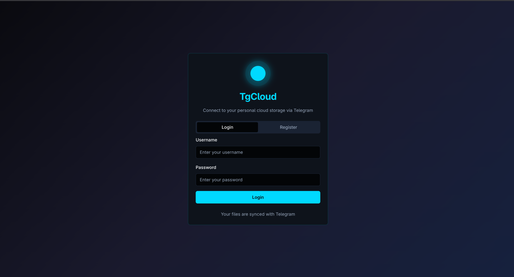
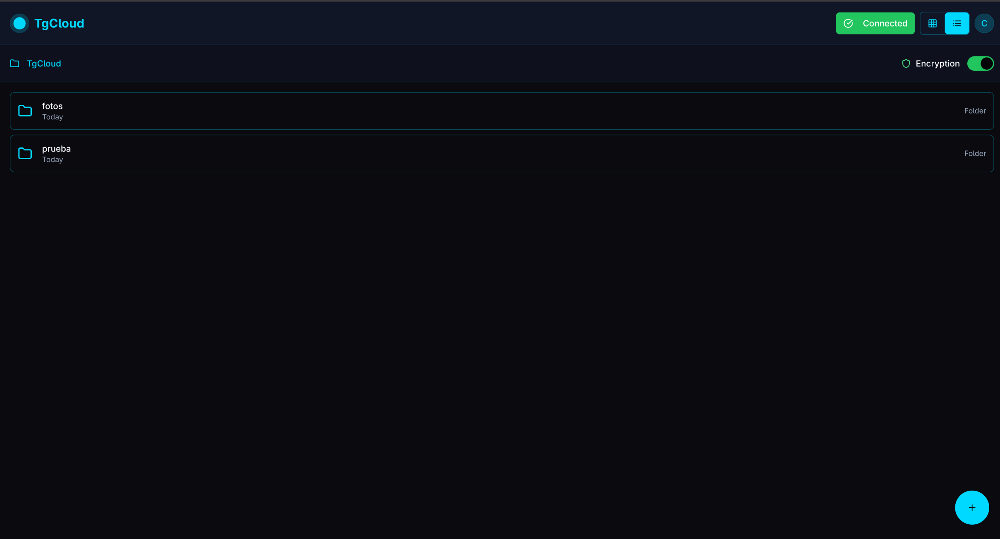
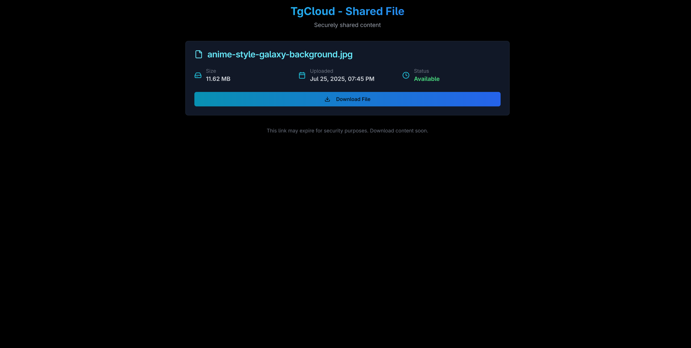
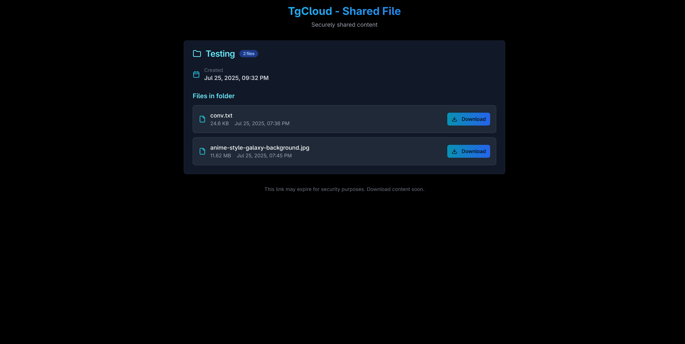

# TgCloud

**Modern cloud storage solution powered by Telegram infrastructure**

TgCloud is a full-stack web application that leverages Telegram's robust messaging platform as a secure, unlimited cloud storage backend. Built with FastAPI and React, it provides enterprise-grade file management with modern UI/UX and secure sharing capabilities.

## Key Features

- **Unlimited Storage**: Leverage Telegram's infrastructure for massive file storage
- **Secure File Sharing**: Generate expiring public links for files and folders
- **Real-time Operations**: WebSocket-powered progress tracking and live updates
- **Modern Interface**: Responsive React frontend with intuitive file management
- **Enterprise Security**: JWT authentication with optional file encryption
- **Zero Configuration**: Single-script deployment with automatic setup
- **Docker Ready**: Containerized deployment for production environments

## Technology Stack

**Backend**
- FastAPI (Python) - High-performance API framework
- SQLAlchemy - Database ORM with SQLite
- Telethon - Telegram client integration
- WebSocket - Real-time communication
- JWT - Secure authentication
- Docker - Containerization

**Frontend**
- React 18 + TypeScript - Modern frontend framework
- Vite - Fast build tool and dev server
- TailwindCSS + ShadcN UI - Styling and components
- TanStack Query - State management and caching
- WebSocket Client - Real-time updates

## Quick Start

### Prerequisites

- Python 3.11+
- Node.js 18+
- Docker and Docker Compose
- Telegram account with API credentials

### 1. Get Telegram Credentials

1. **API Credentials**: Visit [my.telegram.org/apps](https://my.telegram.org/apps)
   - Create a new application
   - Note your `API_ID` and `API_HASH`

2. **Storage Channel**: Create a Telegram channel or group
   - Add your bot to the channel
   - Get the `CHAT_ID` using [@userinfobot](https://t.me/userinfobot)

### 2. Clone and Deploy

```bash
# Clone repository
git clone https://github.com/17tayyy/TgCloud.git
cd TgCloud

# Deploy (production)
python deploy.py deploy

# OR for development
python deploy.py dev
```

### 3. Configuration

The deployment script will create a `.env` file. Edit it with your Telegram credentials:

```bash
# Edit configuration
nano .env
```

```env
# Telegram API (REQUIRED)
API_ID=your_api_id
API_HASH=your_api_hash
CHAT_ID=your_chat_id

# Auto-generated (don't modify)
SECRET_KEY=auto_generated_secure_key
HOST=auto_detected_ip
API_PORT=8000
WEB_PORT=80
```

### 4. Access Your Cloud

- **Web Interface**: `http://your-server-ip`
- **API Documentation**: `http://your-server-ip:8000/docs`

## Deployment Guide

### Production Deployment

TgCloud uses a centralized deployment system for easy production setup:

```bash
# Full production deployment
python deploy.py deploy
```

**What this does:**
1. Auto-detects your server IP address
2. Generates secure secrets and configuration
3. Creates optimized Docker Compose setup
4. Builds and starts all services
5. Configures health checks and monitoring

**Production URLs:**
- Frontend: `http://your-server-ip`
- Backend API: `http://your-server-ip:8000`
- API Docs: `http://your-server-ip:8000/docs`

### Development Mode

For local development without Docker:

```bash
# Start development servers
python deploy.py dev
```

**Development URLs:**
- Frontend: `http://localhost:8080`
- Backend API: `http://localhost:8000`
- API Docs: `http://localhost:8000/docs`

### Management Commands

```bash
python deploy.py stop      # Stop all services
python deploy.py logs      # View system logs
python deploy.py status    # Check service status
python deploy.py clean     # Complete cleanup
python deploy.py setup     # Reconfigure system
```

### Manual Deployment (Advanced)

If you prefer manual control:

**Backend Setup:**
```bash
cd backend
python -m venv venv
source venv/bin/activate
pip install -r requirements.txt
uvicorn main:app --host 0.0.0.0 --port 8000
```

**Frontend Setup:**
```bash
cd frontend
npm install
npm run build
npm run preview
```

**Docker Deployment:**
```bash
docker-compose up -d --build
```

## Project Architecture

```
TgCloud/
├── deploy.py                 # Centralized deployment script
├── .env                      # Configuration file
├── docker-compose.yml        # Container orchestration
├── backend/                  # FastAPI backend
│   ├── app/
│   │   ├── api/
│   │   │   ├── endpoints.py  # REST API routes
│   │   │   └── websocket.py  # WebSocket handlers
│   │   ├── auth/
│   │   │   └── jwt_auth.py   # Authentication logic
│   │   ├── client/
│   │   │   ├── client.py     # Telegram integration
│   │   │   └── files_db.py   # Database models
│   │   ├── services/         # Business logic
│   │   ├── utils/            # Utilities
│   │   └── schemas.py        # Pydantic models
│   ├── Dockerfile
│   ├── requirements.txt
│   └── main.py
├── frontend/                 # React frontend
│   ├── src/
│   │   ├── components/
│   │   │   ├── Dashboard.tsx      # Main interface
│   │   │   ├── SharedFile.tsx     # Public sharing
│   │   │   ├── FileItem.tsx       # File management
│   │   │   ├── Login.tsx          # Authentication
│   │   │   └── ...
│   │   ├── pages/
│   │   │   ├── Index.tsx          # Main page
│   │   │   └── Shared.tsx         # Public access
│   │   ├── contexts/              # React contexts
│   │   ├── services/              # API clients
│   │   └── types/                 # TypeScript definitions
│   ├── Dockerfile
│   ├── package.json
│   └── vite.config.ts
└── docs/                     # Documentation assets
```

## Features Deep Dive

### File Management
- **Upload**: Drag-and-drop or click to upload multiple files
- **Download**: Direct download with progress tracking
- **Organization**: Create folders and move files
- **Preview**: Image and document preview capabilities
- **Batch Operations**: Select and manage multiple files

### Secure Sharing
- **Public Links**: Generate secure tokens for file/folder sharing
- **Expiring Access**: Links expire automatically (60 minutes default)
- **No Authentication**: Shared content accessible without login
- **Progress Tracking**: Real-time download progress for shared files

### Real-time Features
- **Live Updates**: WebSocket-powered real-time interface updates
- **Progress Bars**: Visual feedback for all operations
- **Notifications**: Toast notifications for user actions
- **Status Monitoring**: Live service health monitoring

### Security
- **JWT Authentication**: Secure API access with token-based auth
- **File Encryption**: Optional client-side encryption for sensitive files
- **Secure Tokens**: Cryptographically secure sharing tokens
- **CORS Protection**: Configurable cross-origin request policies

## API Reference

### Authentication Endpoints
```
POST /api/v1/register        # User registration
POST /api/v1/token          # Login and get JWT token
```

### File Operations
```
GET    /api/v1/folders/                    # List folders
POST   /api/v1/folders/                    # Create folder
DELETE /api/v1/folders/{name}              # Delete folder
GET    /api/v1/folders/{name}/files/       # List files
POST   /api/v1/folders/{name}/files/       # Upload file
GET    /api/v1/folders/{name}/files/{file}/download  # Download file
DELETE /api/v1/folders/{name}/files/{file} # Delete file
```

### Sharing Endpoints
```
POST /api/v1/folders/{name}/files/{file}/share  # Share file
POST /api/v1/folders/{name}/share               # Share folder
GET  /access/file/{token}                       # Access shared file
GET  /access/folder/{token}                     # Access shared folder
```

### WebSocket Events
```
/ws  # Real-time progress updates and notifications
```

For complete API documentation, visit `/docs` when the backend is running.

## Screenshots

### Login Interface
*Clean, modern authentication with Telegram integration*



### Main Dashboard
*Intuitive file management with grid and list views*



### File/Folder Sharing
*Secure public sharing with expiring links*





### Mobile Interface

*in development...*

## Configuration

### Environment Variables

| Variable | Description | Default | Required |
|----------|-------------|---------|----------|
| `API_ID` | Telegram API ID | - | Yes |
| `API_HASH` | Telegram API Hash | - | Yes |
| `CHAT_ID` | Telegram Chat/Channel ID | - | Yes |
| `SECRET_KEY` | JWT Secret Key | Auto-generated | No |
| `HOST` | Server Host/IP | Auto-detected | No |
| `API_PORT` | Backend Port | 8000 | No |
| `WEB_PORT` | Frontend Port | 80 | No |
| `NODE_ENV` | Environment | production | No |
| `LOG_LEVEL` | Logging Level | INFO | No |

### Advanced Configuration

**Docker Compose Override:**
Create `docker-compose.override.yml` for custom configurations:

```yaml
version: '3.8'
services:
  backend:
    environment:
      - LOG_LEVEL=DEBUG
    ports:
      - "8001:8000"  # Custom port mapping
  
  frontend:
    environment:
      - NODE_ENV=development
```

**Nginx Reverse Proxy:**
```nginx
server {
    listen 80;
    server_name your-domain.com;
    
    location / {
        proxy_pass http://localhost:80;
        proxy_set_header Host $host;
        proxy_set_header X-Real-IP $remote_addr;
    }
    
    location /api/ {
        proxy_pass http://localhost:8000;
        proxy_set_header Host $host;
        proxy_set_header X-Real-IP $remote_addr;
    }
}
```

## Troubleshooting

### Common Issues

**1. Telegram Connection Failed**
```bash
# Check Telegram credentials
python deploy.py setup

# Verify API credentials at my.telegram.org
# Ensure CHAT_ID is correct (negative for channels)
```

**2. Docker Permission Denied**
```bash
# Add user to docker group
sudo usermod -aG docker $USER
logout  # and login again

# Or use sudo with deployment
sudo python deploy.py deploy
```

**3. Port Already in Use**
```bash
# Check running services
python deploy.py status

# Stop conflicting services
python deploy.py stop
sudo fuser -k 8000/tcp  # Kill process on port 8000
```

**4. Build Failures**
```bash
# Clean rebuild
python deploy.py clean
python deploy.py deploy

# Check logs
python deploy.py logs
```

### Debug Mode

Enable debug logging for troubleshooting:

```bash
# Edit .env file
LOG_LEVEL=DEBUG

# Restart services
python deploy.py stop
python deploy.py deploy

# View detailed logs
python deploy.py logs
```

## Contributing

We welcome contributions! Please follow these guidelines:

### Development Setup
```bash
# Fork and clone the repository
git clone https://github.com/yourusername/TgCloud.git
cd TgCloud

# Create development environment
python deploy.py dev

# Make your changes and test
# Submit a pull request
```

### Code Standards
- **Backend**: Follow PEP 8 for Python code
- **Frontend**: Use ESLint and Prettier for TypeScript/React
- **Commits**: Use conventional commit messages
- **Documentation**: Update README and inline docs

### Pull Request Process
1. Fork the repository
2. Create a feature branch (`git checkout -b feature/amazing-feature`)
3. Commit your changes (`git commit -m 'Add amazing feature'`)
4. Push to the branch (`git push origin feature/amazing-feature`)
5. Open a Pull Request with detailed description

## Support

- **Issues**: [GitHub Issues](https://github.com/17tayyy/TgCloud/issues)
- **Discussions**: [GitHub Discussions](https://github.com/17tayyy/TgCloud/discussions)
- **Documentation**: Check this README and `/docs` endpoint

## License

This project is licensed under the MIT License - see the [LICENSE](LICENSE) file for details.

## Acknowledgments

- **Telegram** - For providing robust messaging infrastructure
- **FastAPI** - For the excellent Python web framework
- **React** - For the powerful frontend library
- **Community** - For contributions and feedback

---

**TgCloud** - Unlimited cloud storage, simplified. 